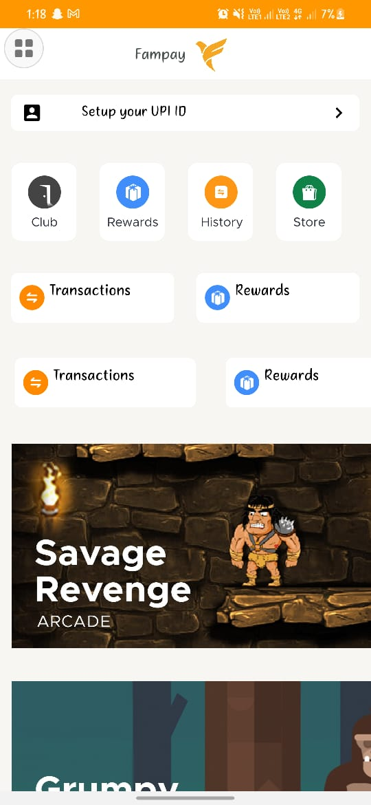

# TASK:
To Develope an Android standalone container, that displays a list of Contextual Cards.

# Expected Deliverables:
- [ ] All deeplinks (card, CTAs, Formatted Text entities) should be handled.
- [x] Implement swipe down to refresh feature
- [x] Handle loading and error states
- [x] Design should match as closely as possible to the one on Figma
- [x] Write structured code with flexible and reusable components
- [x] On tapping "remind later" action on a card, it should be removed from the display.
- [x] On tapping "dismiss now" action, it should be removed from the display. This card should never be visible again.
- [x] On long press of Big Display Card (HC3), it should slide to the right and display action buttons as per the design

# Resources:

* API: https://run.mocky.io/v3/fefcfbeb-5c12-4722-94ad-b8f92caad1ad
* DESIGN: https://www.figma.com/file/AvK2BRGwMTv4kQab5ymJ0K/AAL3-%3A-Android-assignment-Design-Specs?node-id=0%3A1

# Output:

______________
